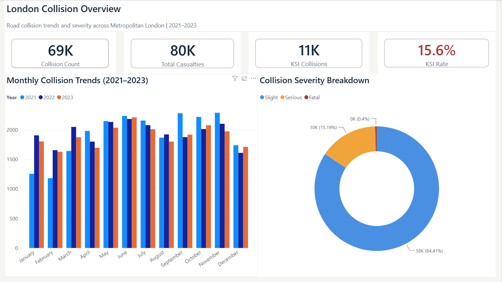
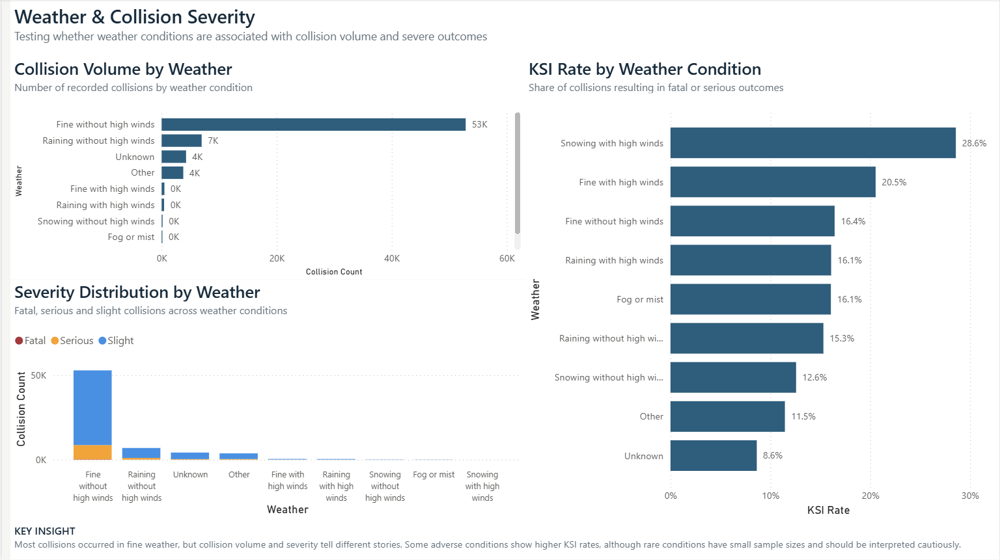
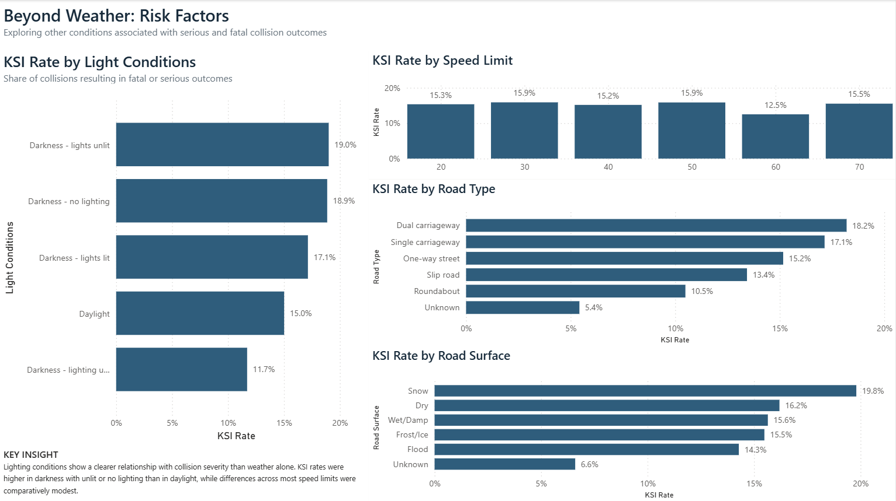

# More Than Just Weather
## What Drives Road Collision Severity in London?

**Power BI | Power Query | DAX | Data Analysis**

## Overview

Are London's most severe road collisions really driven by bad weather?

This project analyses road collision data from Metropolitan London between 2021 and 2023 to investigate whether weather conditions are associated with collision volume and severity — and whether other environmental and road conditions reveal stronger patterns.

The project uses Power Query for data preparation, DAX for KPI development, and Power BI for analysis and visualisation.

---

## Business Question

Understanding when severe road collisions occur can support better transport safety analysis and may provide useful context for emergency-service demand planning.

The analysis asks:

1. How did collision volume and severity change between 2021 and 2023?
2. Are adverse weather conditions associated with higher collision volume or severity?
3. What other road and environmental conditions are associated with serious or fatal collisions?

---

## Dashboard

The Power BI report contains three analytical pages.

### 1. London Collision Overview

Provides a high-level view of collision volume, casualties, KSI collisions, severity distribution and monthly trends across 2021–2023.

### 2. Weather & Severity

Compares collision volume and severity across weather conditions, distinguishing between how frequently collisions occur and the proportion resulting in serious or fatal outcomes.

### 3. Beyond Weather: Risk Factors

Explores KSI rates across lighting conditions, road types, road surfaces and posted speed limits.

---

## Key Metrics

- Approximately **69,000 road collisions** were analysed across 2021–2023.
- Approximately **11,000 collisions were KSI**.
- Around **16% of recorded collisions were classified as KSI**.

**KSI = Killed or Seriously Injured**, defined in this project as collisions classified as Fatal or Serious.

---

## Key Findings

### Most collisions occurred in fine weather

Fine weather without high winds accounted for substantially more recorded collisions than adverse weather conditions.

Rain accounted for a much smaller share, while snow, fog and high-wind conditions represented relatively few collisions.

This challenges the simple assumption that bad weather is the main driver of road collision volume.

### Collision volume and severity tell different stories

Raw collision counts alone do not describe severity.

To investigate this, the analysis calculated the **KSI Rate**:

**KSI Rate = Fatal or Serious Collisions / Total Collisions**

Some rare adverse weather conditions displayed high KSI rates, but those percentages were sometimes based on extremely small samples.

For example, **snowing with high winds produced a KSI rate of approximately 28.6%, but this represented only 7 collisions**.

This demonstrates why rates should always be interpreted alongside sample size.

### Lighting showed a stronger severity pattern

Lighting conditions produced one of the clearest differences in severity.

Collisions recorded in **darkness with unlit lighting** showed a KSI rate of approximately **19%**, compared with roughly **15% in daylight**.

Unlike the rare weather categories, this result was supported by approximately **1,000 collisions**, making it a more substantial descriptive finding.

### Road environment also showed differences

KSI rates varied across road types and road-surface conditions.

Dual and single carriageways showed higher severity rates than roundabouts in the analysed data.

Snow-covered road surfaces also showed a comparatively high KSI rate, but this result was based on only **101 collisions**, so it should be interpreted cautiously.

### Speed limit did not show a simple linear pattern

The analysis did not show a straightforward relationship where higher posted speed limits consistently corresponded with higher KSI rates.

Most speed-limit categories had relatively similar severity rates, suggesting that road environment and collision context may matter alongside posted speed.

---

## Key Insight

**Weather alone does not explain London's collision severity patterns.**

Although some adverse conditions displayed high KSI rates, the most extreme percentages were often based on very small numbers of collisions.

Lighting and other road-environment characteristics showed more substantial differences, suggesting that collision severity is associated with a broader combination of environmental and road conditions.

---

## Methodology

### Data Preparation

Three years of UK Department for Transport road collision data — 2021, 2022 and 2023 — were combined in Power BI.

Power Query was used to:

- combine the three annual datasets;
- filter records to Metropolitan London using the police-force code;
- promote and standardise headers;
- correct data types;
- remove repeated header rows;
- validate errors and empty values;
- check duplicate collision IDs;
- convert coded variables into readable categories;
- derive month, month number, hour, time of day and year-month fields;
- create readable severity, weather, lighting, road-surface and road-type fields.

### Data Modelling

A dedicated KPI Measures table was created to keep DAX calculations separate from the main collision data.

Measures included:

- Collision Count
- Total Casualties
- Fatal Collisions
- Serious Collisions
- Slight Collisions
- KSI Collisions
- KSI Rate
- Average Casualties per Collision
- Average Vehicles per Collision
- Previous Year Collisions
- Year-on-Year Collision Change %

The core DAX calculations are documented in [`DAX_Measures.md`](DAX_Measures.md).

---

## Tools & Skills

- Power BI
- Power Query
- DAX
- Data Cleaning
- Data Transformation
- Data Modelling
- KPI Development
- Exploratory Data Analysis
- Data Visualisation
- Analytical Storytelling
- Data Quality Validation

---

## Limitations

This analysis identifies **associations rather than causation**.

The collision dataset records collisions that occurred but does not measure total road exposure. Therefore, a condition having more collisions does not necessarily mean that condition creates a greater probability of collision.

Rare categories can also produce unstable percentage rates. KSI rates were therefore interpreted alongside collision counts.

The analysis also does not contain ambulance-demand, A&E attendance, hospital-admission or staffing data.

The findings may provide useful context for emergency-service planning, but the dashboard does not directly predict NHS demand.

---

## Future Development

Future analysis could combine collision records with:

- traffic-volume data;
- detailed weather observations;
- geographic and road-network information;
- ambulance call-out data;
- A&E attendance data.

This could extend the analysis from:

**“Under what conditions do severe collisions occur?”**

toward:

**“When and where should emergency services expect elevated collision-related demand?”**

---

## Data Source

**UK Department for Transport — Road Safety Open Data**

Collision data used: **2021–2023**

Geographic focus: **Metropolitan London**

The original datasets are not stored in this repository due to their size. See [`data/README.md`](data/README.md) for details.
